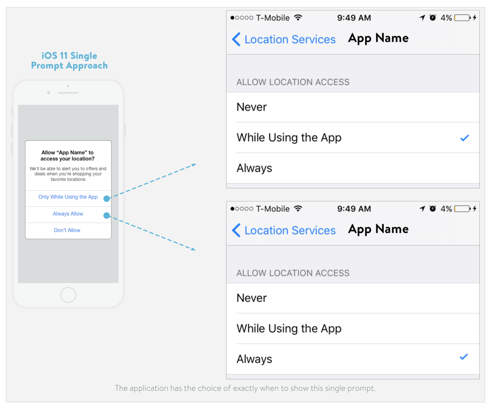
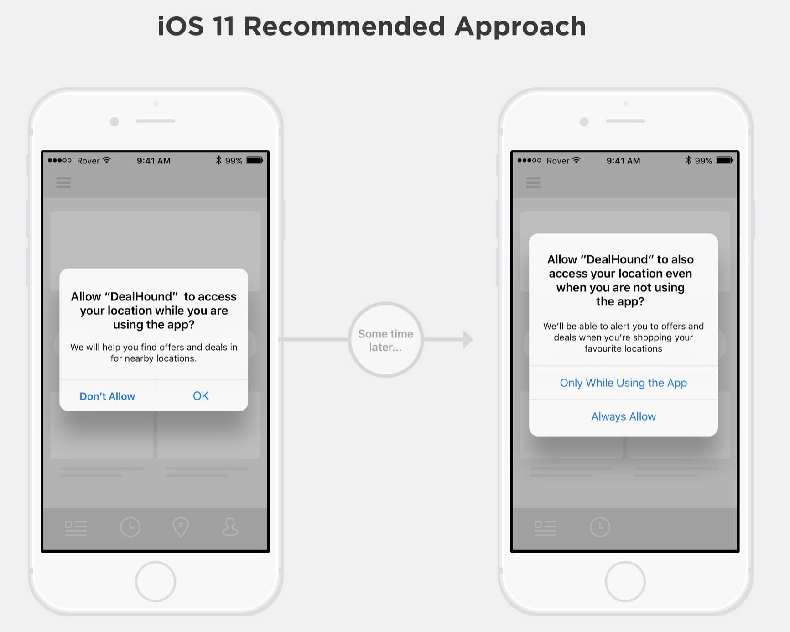

In iOS 11, it is mandatory to add the `NSLocationWhenInUseUsageDescription` and the `NSLocationAlwaysAndWhenInUsageDescription` keys to our Info.plist file, if we request ‘always on’ permission. Therefore, with these new rules, users will automatically be given all three options when they open an app requesting location for the first time. These mandatory location permission options are: `When In Use`, `Always`, and `Never`, as the following image.

As you may notice the option for `When In Use` is placed as the first option. It is clear that Apple is pushing developers in the direction of only asking for the `When In Use` permission. However, according to [Apple's documentation](https://developer.apple.com/documentation/corelocation/clauthorizationstatus/kclauthorizationstatusauthorizedwheninuse?language=objc), `When In Use` permission doesn't allow us to use region monitoring and the significant location change services. Consequently, if users choose `When In Use` permission, our beacon monitoring and Geo-fencing features won't work at all.

For those seeking `Always` permission, Apple is now recommending a new permission flow which is essentially a two-phased approach. The first phase should only ask for `When In Use` permission. After the user has engaged with our app and better understands the value and use cases provided to them with location tracking, trust has been earned and publishers can present users the option to upgrade and request the `Always` permission level. The following is an example image.

Nevertheless, if we adopt this two-phased approach, it is vital to let users understand beacon monitoring and Geo-fencing don't work unless they give `Always` permission. That means there must be some changes related to UI/UX.

One possible workaround is we request `When In Use` permission at first. Once the user agrees, we immediately request `Always` permission again. In this case, users will see the above two-phased alerts one after the other. Generally speaking, this isn't what Apple suggests us doing, and it is necessary to provide an expressive message in each alert.

### Reference
* [WWDC 2017 Update: Significant Updates to Location Permissions Coming With iOS 11](https://m.rover.io/wwdc-2017-update-significant-updates-to-location-permissions-coming-with-ios-11-41f96001f87f)
* [iOS 11 Location Services Best Practices for App Developers](https://gimbal.com/ios11-location-services-best-practices/)
* [Request Always Authorization](https://developer.apple.com/documentation/corelocation/choosing_the_authorization_level_for_location_services/request_always_authorization)
